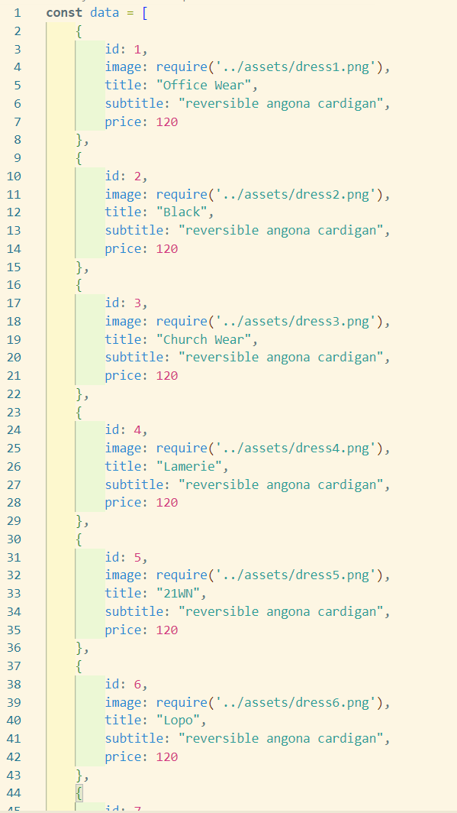
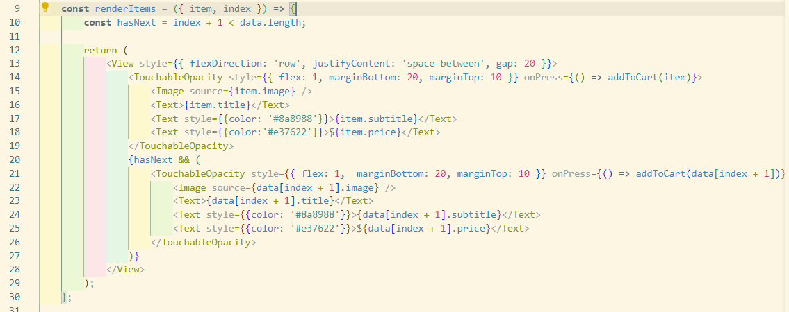
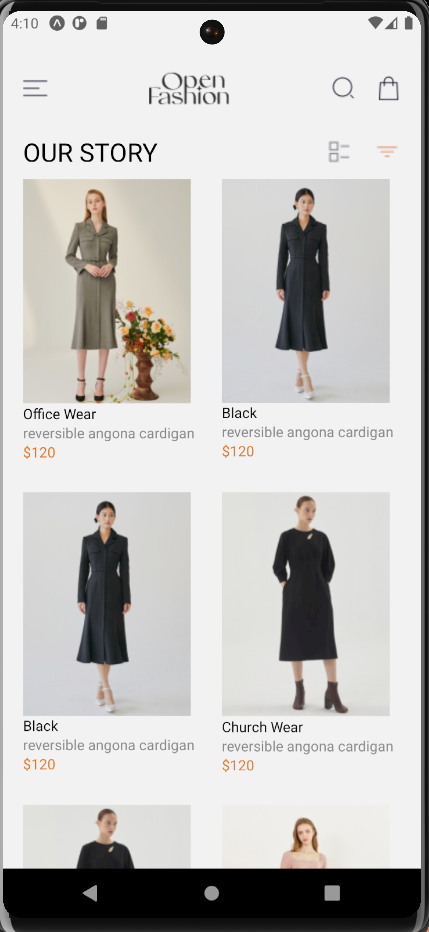
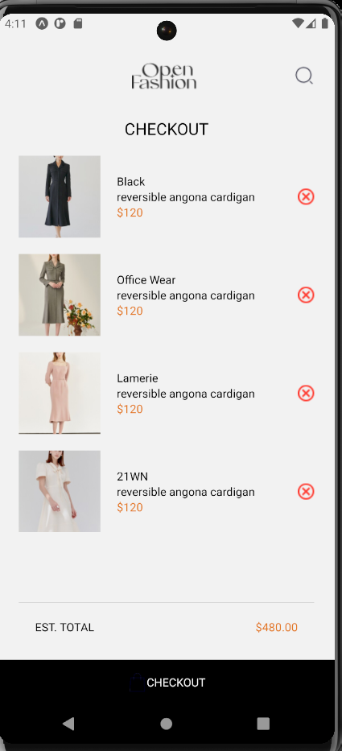

#### OPEN FASHION APP

##### Design Choices
The original UI design required items to be arranged side by side, which posed a challenge with React Native’s FlatList component due to its conventional vertical rendering.

###### Implementation Approach

##### Data Organization:

I created a file named data.js to centrally manage all the data that would be rendered on both the home screen and the checkout screen.
Custom Rendering Logic:

On the home screen, I implemented a custom renderItem component. Within this component, I devised a method to render items side by side based on their index. Even-numbered indices were positioned on the right, while odd-numbered indices were placed on the left.
Outcome:

This approach allowed me to faithfully reproduce the design in code, ensuring that items were displayed as specified in the UI mockups.

// Sample code snippet demonstrating the custom rendering logic

##### Outcome

This approach allowed me to faithfully reproduce the design in code, ensuring that items were displayed as specified in the UI mockups.

HomeScreen

CheckoutScreen

Conclusion
By leveraging custom rendering logic and thoughtful data organization, I successfully achieved the desired layout without compromising on design fidelity or performance in the React Native environment.

